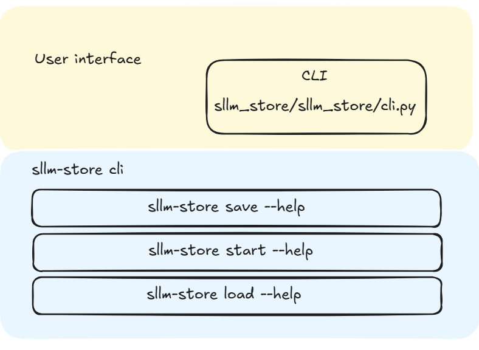

# Integrate Sglang Into Sllm Overview

## Table of Contents

- [ServerlessLLM Architecture Overview](#serverlessllm-architecture-overview)
  - [Table of Contents](#table-of-contents)
  - [Introduction](#introduction)
  - [ServerlessLLM Store New CLI](#serverlessllm-store)
  - [ServerlessLLM Store](#serverlessllm-store)
  - [Sgang Integration](#serverlessllm-store)
  - [Conclusion and Future Work](#conclusion-and-future-work)

## Introduction of SLLM Store

*Sllm-store* introduces an intelligent multi‑tier storage and rapid checkpoint loading mechanism that maximises storage bandwidth utilisation, ensures stable and predictable loading performance, and maintains framework‑agnostic compatibility, thereby enabling ServerlessLLM to deliver low‑latency inference on demand.We make a set of common assumptions about checkpoints:  

This article will walk you through the system architecture of *sllm* and aims to answer the following questions:

- How will the new design of CLI **start,load,save** improves the usability via **Clicks**?
- How is the current  **sglang working**?
- How do we **save and load model of sglang** checkpoints in sllm version?

The goal of this summer internship is to gain a deep understanding of serverless LLM architectures and implement support for the new SGLang backend, enabling fast model checkpoint loading.

## ServerlessLLM Click New Design
Model management utilities—such as loading and saving models or LoRA adapters—are currently scattered throughout the examples directory (https://github.com/ServerlessLLM/ServerlessLLM/tree/main/sllm_store/examples), making them difficult to find and use. Centralising these commands would improve usability and streamline the developer experience. Click’s decorator-based API, built-in colour styling and interactive prompts, plus one‑line shell completion, make CLI development concise, powerful, and a delight to use.

  

- **User Interface**: Includes a CLI for model and cluster management and an API gateway that routes control messages to the controller and inference requests to the appropriate router.
- **SLLM Store -start**: Use sllm-store start with flags like --host, --port, --storage-path, --num-thread, --chunk-size, --mem-pool-size, --disk-size, and --registration-required to launch the checkpoint store gRPC server (e.g. sllm-store start --storage-path $PWD/models --mem-pool-size 4GB).
- **SLLM Store -save**: selecting your HuggingFace model, backend (vLLM/Transformers/sglang), LoRA adapter, tensor parallelism, and local storage paths.
- **SLLM Store -load** Use sllm-store load with options like --model, --backend, --adapter-name, --precision, --tensor-parallel-size and --storage-path to fetch and configure a model from the local checkpoint store.

Just remember: before saving or loading a vLLM/sglang backend model with sllm-store, you need to apply the required **patch** to keep everything running smoothly.From here, we’ll dive into our new sglang backend that equips sllm with seamless, high‑performance support.

# Sglang

## Fast Checkpoint Loading

The model loading subsystem of SGLang—encapsulated in the `loader.py` module—is architected to minimize initialization latency through a confluence of advanced techniques.

## Features

- **Concurrent, Stream‑Oriented I/O**  
  - `pt_weights_iterator`, `safetensors_weights_iterator`, `np_cache_weights_iterator`  
  - Pipelined disk reads, decoding, and device transfers across multiple threads  
  - Overlaps computation and data movement to amortize I/O overhead  

- **Tensor‑Parallel Sharding & On‑The‑Fly Quantization**  
  - Uses `get_tensor_model_parallel_rank/size` for distributed shard loading  
  - Applies int4, fp8, AWQ, or GPTQ quantization during load time via `QuantizationConfig`  
  - Eliminates separate quantization passes, reducing memory footprint  

## 1. Introduction 

  

The **SGLang Engine** (`engine.py`) serves as the primary entry point for all inference workloads—offline batch processing, synchronous/asynchronous calls, streaming scenarios, and web‑service endpoints—by abstracting process orchestration, IPC, model lifecycle management, and scheduling behind a concise Python API.

## 2. Architectural Overview  
- **TokenizerManager (Main Process)**  
  - Performs text preprocessing and tokenization.  
  - Dispatches tokenized requests via ZeroMQ to downstream workers.  
- **Scheduler (Worker Subprocess)**  
  - Batches incoming requests to maximize throughput.  
  - Routes batches to the backend runtime and aggregates token outputs.  
- **DetokenizerManager (Worker Subprocess)**  
  - Reconstructs token streams into text or multimodal outputs.  
  - Returns final payloads through the ZeroMQ response channel.  
- **ZeroMQ IPC Layer**  
  - Employs `zmq.asyncio` for high‑throughput, low‑latency, and reliable inter‑process communication.  
  - Supports configurable backpressure and distributed deployment.

Integrating SGLang into sllm‑store is predicated on aligning SGLang’s advanced asynchronous scheduling, lazy‑loading semantics, and distributed cold‑start protocols with sllm‑store’s minimalist‑deployment, high‑concurrency architecture. This confluence yields a unified inference substrate that minimizes initialization latency, maximizes throughput under heavy concurrent workloads, and defers resource instantiation—thereby maintaining near‑constant startup times without incurring appreciable runtime overhead.

  

**Step 1: Save a Model**

  

The`save_model`function takes a *Transformers* pre-trained model and an output path as inputs. It first saves model configurations using *Transformers*’ built-in API, then calls the PyTorch API (`sllm_store.torch.save_dict`) to save the model’s `state_dict` in a cold-start optimized format.

The `save_dict` function uses the checkpoint parser via `save_tensors`, which saves each tensor’s data in a binary file and returns its offset within that file. After saving tensors, the `save_dict` function records tensor metadata and offsets to an index file. This setup enables efficient retrieval during model loading.

**Step 2: Load a Model**

  

The `load_model`function takes a model path as input and returns a *Transformers* pre-trained model. It initializes the model with saved configurations and concurrently calls the PyTorch API (`sllm_store.torch.load_dict`) to load the tensors.

The PyTorch API allocates GPU memory for each tensor, calling the standalone checkpoint manager (via gRPC) to load tensor data into designated addresses. Simultaneously, `load_model` uses the checkpoint parser to restore tensors based on the saved tensor metadata, inferring actual GPU memory addresses using the base GPU memory address and saved tensor offsets.

Before returning the model, a final sync call is sent to the checkpoint manager to ensure all data has loaded correctly.

## Conclusion and Future Work

In the next blog post, we’ll demonstrate a deployment example of Serverless RAG. Future posts will also explore specific topics in greater detail, including the scheduling algorithm, cold-start optimized checkpoint format, and the efficient multi-tier checkpoint loading pipeline.
